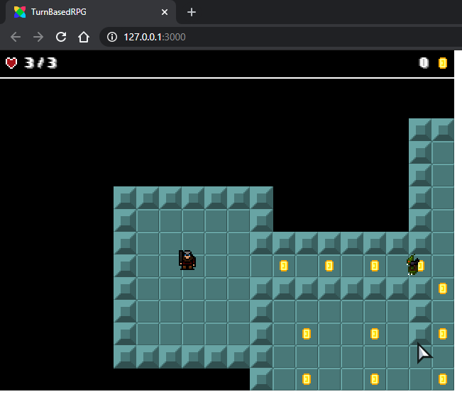
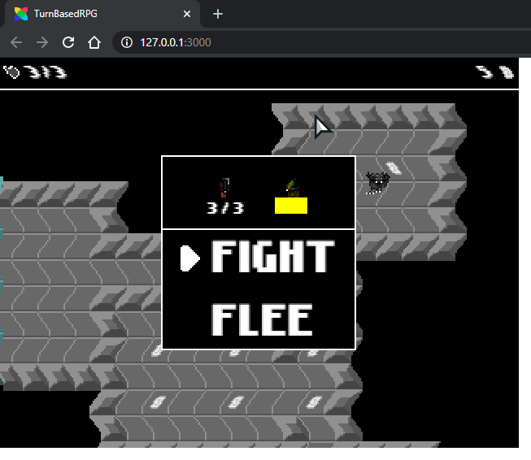

Now we want to show the player what's going on. So we need to have some kind of HUD on the screen to tell them what their current/max health is, and how many coins they have. For the health icon you can use this image , or make your own. Make sure you save this in `assets/images`.

1. We'll start by making a new `HUD` class which will hold all our HUD elements:

	```haxe
	package;

	import flixel.FlxG;
	import flixel.FlxSprite;
	import flixel.group.FlxGroup.FlxTypedGroup;
	import flixel.text.FlxText;
	import flixel.util.FlxColor;

	using flixel.util.FlxSpriteUtil;

	class HUD extends FlxTypedGroup<FlxSprite>
	{
		var background:FlxSprite;
		var healthCounter:FlxText;
		var moneyCounter:FlxText;
		var healthIcon:FlxSprite;
		var moneyIcon:FlxSprite;

		public function new()
		{
			super();
			background = new FlxSprite().makeGraphic(FlxG.width, 20, FlxColor.BLACK);
			background.drawRect(0, 19, FlxG.width, 1, FlxColor.WHITE);
			healthCounter = new FlxText(16, 2, 0, "3 / 3", 8);
			healthCounter.setBorderStyle(SHADOW, FlxColor.GRAY, 1, 1);
			moneyCounter = new FlxText(0, 2, 0, "0", 8);
			moneyCounter.setBorderStyle(SHADOW, FlxColor.GRAY, 1, 1);
			healthIcon = new FlxSprite(4, healthCounter.y + (healthCounter.height/2)  - 4, AssetPaths.health__png);
			moneyIcon = new FlxSprite(FlxG.width - 12, moneyCounter.y + (moneyCounter.height/2)  - 4, AssetPaths.coin__png);
			moneyCounter.alignment = RIGHT;
			moneyCounter.x = moneyIcon.x - moneyCounter.width - 4;
			add(background);
			add(healthIcon);
			add(moneyIcon);
			add(healthCounter);
			add(moneyCounter);
			forEach(function(sprite) sprite.scrollFactor.set(0, 0));
		}

		public function updateHUD(health:Int, money:Int)
		{
			healthCounter.text = health + " / 3";
			moneyCounter.text = Std.string(money);
			moneyCounter.x = moneyIcon.x - moneyCounter.width - 4;
		}
	}
	```

	This class extends `FlxTypedGroup<FlxSprite>` so that it can hold all of our `FlxSprite` objects. It is composed of 5 different items: a background (black, with a 1-pixel thick white line along the bottom), 2 `FlxText` objects: 1 for health, and 1 for money, and two `FlxSprite` objects, for the icons to go next to the `FlxText` objects. At the end of our constructor, we have a `forEach()` call - we use this to iterate through each of the items in this group, and it just sets their `scrollFactor.x` and `scrollFactor.y` to 0, meaning, even if the camera scrolls, all of these items will stay at the same position relative to the screen.

	Finally, we have a function that we can call from anywhere to tell the `HUD` what it should display.

2. Now let's get it to work and have it update whenever we pick up a coin. In your `PlayState`, add this to the top of the class:

	```haxe
	var hud:HUD;
	var money:Int = 0;
	var health:Int = 3;
	```

3. In `create()`, before `super.create()`, add:

	```haxe
	hud = new HUD();
	add(hud);
	```

4. Finally, in the `playerTouchCoin()` function we added earlier, somewhere inside the `if`-statement, add:

	```haxe
	money++;
	hud.updateHUD(health, money);
	```

Go ahead and test out your game, and the HUD should update each time you pick up a coin!



If we had a way to 'hurt' the player, we could also update the health on the HUD… but in order to do that, we need to figure out how we're going to do combat!

Let's begin by establishing what we want our combat system to achieve. First, we're not going to be making the next Final Fantasy game here, this is just a basic demonstration to show how a few different elements can work. So, I think all we want to do is have a simple interface that appears when the player touches an enemy that shows the player's health, and the enemy's health (in a health bar, for obfuscation), and gives the player 2 options: `FIGHT` or `FLEE`.

If they choose to fight, we'll roll some random chance checks to see if the player hits the enemy, and if the enemy hits the player - a hit will do 1 damage. Once the enemy dies, we'll continue on. If they choose to flee, we'll do a check to see if they do flee or not - if they do, the interface closes and the enemy will be stunned for a few seconds so the player can move away. If they fail to flee, the enemy will get a free hit against the player. We'll also show the damage and misses on the interface.

This all seems simple enough, but it's actually going to require several components working together to make it work. It's the most complicated piece of our game so far.

1. The first component will be our `CombatHUD` class. This is a pretty big class - it's going to do most of the heavy lifting with our combat logic. You can see the complete class here:

	[CombatHUD.hx](https://github.com/HaxeFlixel/flixel-demos/blob/master/Tutorials/TurnBasedRPG/source/CombatHUD.hx)

	Take some time to read through it to see how it works, then add it to your project.

	We already have most of the assets used by the `CombatHUD`, but there is one image file we still need - an arrow the player can use to select a choice. Download it from [this link](https://raw.githubusercontent.com/HaxeFlixel/flixel-demos/master/Tutorials/TurnBasedRPG/assets/images/pointer.png) (or make your own), name it `pointer.png` and add it to the `assets/images` folder.

	The `CombatHUD` also uses something we haven't discussed yet: *sounds*. We'll dig in to this more in the Sound and Music section. For now, just download these files and place them in the `assets/sounds` folder. This will ensure the code compiles.

	- [combat.wav](https://raw.githubusercontent.com/HaxeFlixel/flixel-demos/master/Tutorials/TurnBasedRPG/assets/sounds/combat.wav)

	- [fled.wav](https://raw.githubusercontent.com/HaxeFlixel/flixel-demos/master/Tutorials/TurnBasedRPG/assets/sounds/fled.wav)

	- [hurt.wav](https://raw.githubusercontent.com/HaxeFlixel/flixel-demos/master/Tutorials/TurnBasedRPG/assets/sounds/hurt.wav)

	- [lose.wav](https://raw.githubusercontent.com/HaxeFlixel/flixel-demos/master/Tutorials/TurnBasedRPG/assets/sounds/lose.wav)

	- [miss.wav](https://raw.githubusercontent.com/HaxeFlixel/flixel-demos/master/Tutorials/TurnBasedRPG/assets/sounds/miss.wav)

	- [select.wav](https://raw.githubusercontent.com/HaxeFlixel/flixel-demos/master/Tutorials/TurnBasedRPG/assets/sounds/select.wav)

	- [win.wav](https://raw.githubusercontent.com/HaxeFlixel/flixel-demos/master/Tutorials/TurnBasedRPG/assets/sounds/win.wav)

2. Now, you will need to add a small function to our `Enemy` class:

	```haxe
	public function changeType(type:EnemyType)
	{
		if (this.type != type)
		{
			this.type = type;
			var graphic = if (type == BOSS) AssetPaths.boss__png else AssetPaths.enemy__png;
			loadGraphic(graphic, true, 16, 16);
		}
	}
	```

3. Next, we need to get our `CombatHUD` into our `PlayState`. Add this to the top of the `PlayState` class:

	```haxe
	var inCombat:Bool = false;
	var combatHud:CombatHUD;
	```

4. Move down to `create()`, and, after we add the HUD, and before we call `super.create()`, add:

	```haxe
	combatHud = new CombatHUD();
	add(combatHud);
	```

5. Go down to our `update()`, and change it so that we're ONLY checking for collisions and overlaps when we're not in combat. Everything after the `super.update()` should look like this:

	```haxe
	if (inCombat)
	{
		if (!combatHud.visible)
		{
			health = combatHud.playerHealth;
			hud.updateHUD(health, money);
			if (combatHud.outcome == VICTORY)
			{
				combatHud.enemy.kill();
			}
			else
			{
				combatHud.enemy.flicker();
			}
			inCombat = false;
			player.active = true;
			enemies.active = true;
		}
	}
	else
	{
		FlxG.collide(player, walls);
		FlxG.overlap(player, coins, playerTouchCoin);
		FlxG.collide(enemies, walls);
		enemies.forEachAlive(checkEnemyVision);
		FlxG.overlap(player, enemies, playerTouchEnemy);
	}
	```

	So, we're adding a check to see if the player touches an enemy. If they do, we'll call a callback to see if we should start combat or not.

	If we're in combat, we're simply going to keep checking to see if the combat HUD is still visible - once it becomes invisible, we know that combat has finished, and we can determine the outcome. If the outcome is `VICTORY` (one of our four enum values), we will kill the enemy, but if the player fled the battle, we will make the enemy flicker, to show that the player is safe from fighting it again for a short amount of time.

6. You may have noticed that our `Enemy` class does not have a `flicker()` function. That's because we're going to use one found in the `FlxSpriteUtil` class. Haxe has a nice feature to help us do so. Add this line at the top of the `PlayState` file, just after your imports:

	```haxe
	using flixel.util.FlxSpriteUtil;
	```

	This will allow us to use the APIs in the `FlxSpriteUtil` class, such as `flicker()`, which can be used on any `FlxObject`. For more on how this works, take a look at [the Haxe documentation](https://haxe.org/manual/lf-static-extension.html).

7. Next, let's add the functions to handle the player touching an enemy:

	```haxe
	function playerTouchEnemy(player:Player, enemy:Enemy)
	{
		if (player.alive && player.exists && enemy.alive && enemy.exists && !enemy.isFlickering())
		{
			startCombat(enemy);
		}
	}

	function startCombat(enemy:Enemy)
	{
		inCombat = true;
		player.active = false;
		enemies.active = false;
		combatHud.initCombat(health, enemy);
	}
	```

	All we're doing here is verify that both the player and the enemy are alive and exist, as well as that the enemy is not flickering (flickering enemies are those we've just fled from). If so, we start combat.

	The `startCombat()` function simply sets our `inCombat` flag (so we know not to do collisions), and sets the player and all the enemies to inactive, so they no longer update.

	Finally, we call `initCombat()` in our `CombatHUD`, which initializes it and makes it start working.

8. Finally, we want enemies that are flickering to not move - they should act kind of stunned for a second after the enemy flees.

	In the `Enemy` class, under `update()`, add:

	```haxe
	if (this.isFlickering())
		return;
	```

	At the very top, before doing anything else in that function.

	Note that `isFlickering()` comes from `FlxSpriteUtil`. So, just like before, you will also need to add the `using` line at the top of the `Enemy` class file:

	```haxe
	using flixel.util.FlxSpriteUtil;
	```

And that should do it! Test out your game and make sure that it works!



Next, we'll cover winning and losing and setting up all our different states.
